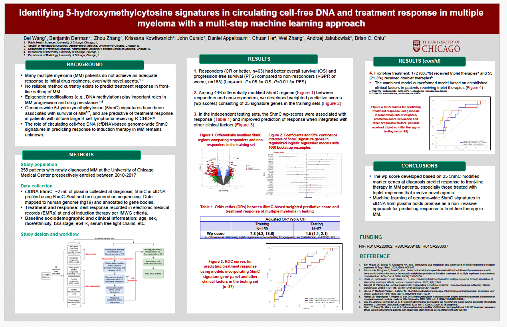

# Identifying 5-hydroxymethylcytosine (5hmC) signatures in circulating cell-free DNA and treatment response in multiple myeloma with a machine learning approach

This project is part of my doctoral dissertation, which is steadily taking shape—exciting times! Below is a poster based on this work, presented at the 2024 ASH Annual Meeting & Exposition. I will add more sharable content under this project once I get a chance. 

## **Citation**  

> Wang, B., Derman, B. A., Zhang, Z., Kowitwanich, K., Cursio, J. F., Appelbaum, D., ... & Chiu, B. (2024). Identifying 5-Hydroxymethylcytosine Signatures in Circulating Cell-Free DNA and Treatment Response in Multiple Myeloma with a Multi-Step Machine Learning Approach. Blood, 144, 3336.

