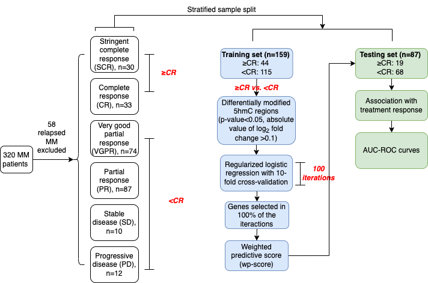
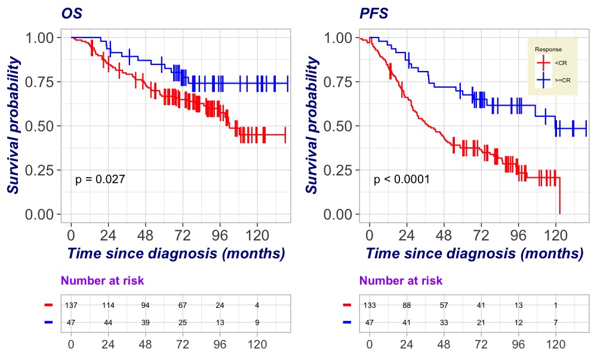
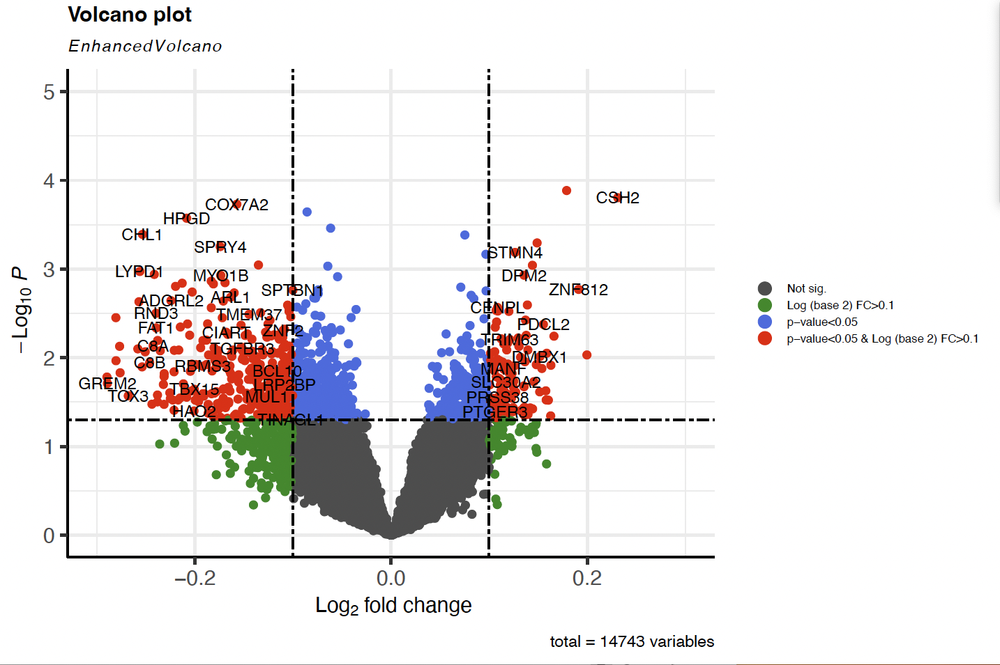
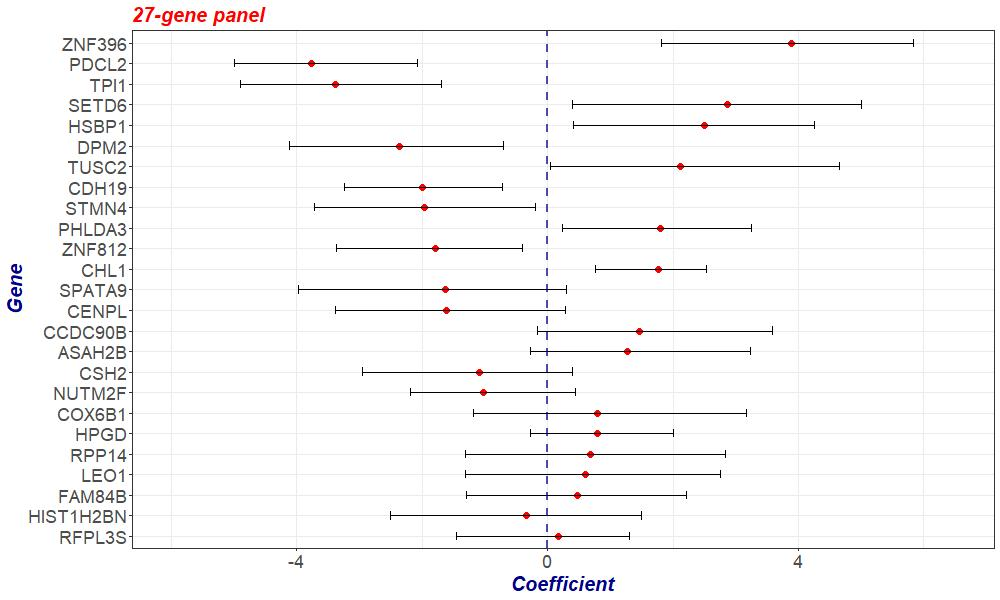
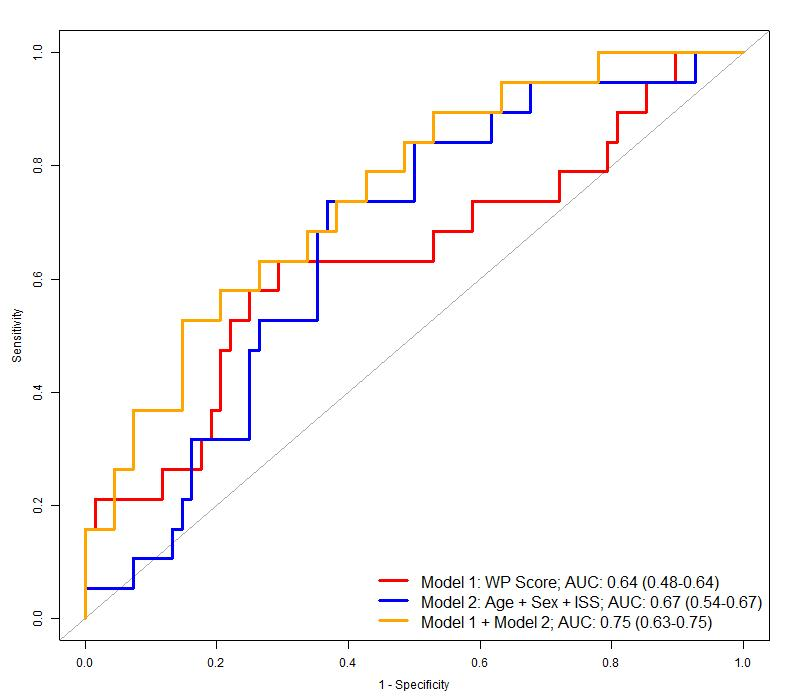
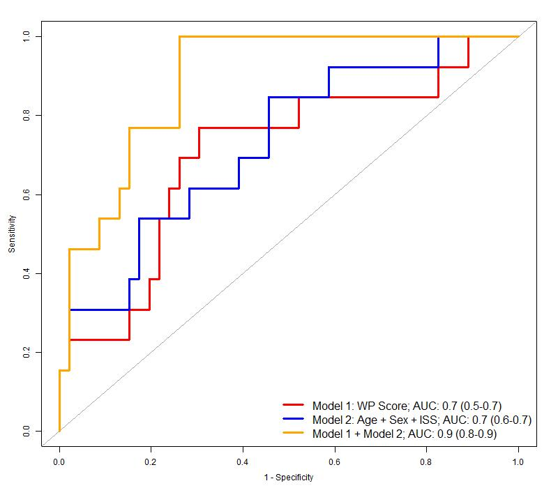
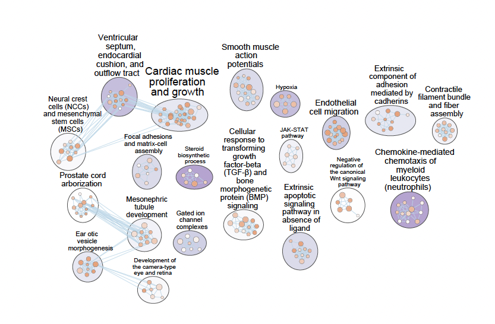

# Identifying 5-hydroxymethylcytosine (5hmC) signatures in circulating cell-free DNA and treatment response in multiple myeloma with a machine learning approach (2023-2025)

# Background and importance 

Despite recent therapeutic advancements in multiple myeloma (MM), many patients do not achieve an adequate response to initial drug regimens, even with novel agents. Currently, there is no reliable method to predict treatment response in front-line setting of MM. Genome-wide 5-Hydroxymethylcytosine (5hmC) alterations in circulating cell-free DNA (cfDNA) have been associated with survival outcomes of MM and are predictive of treatment response in several human cancers. The role of cfDNA-based genome-wide 5hmC in predicting treatment response in MM has not been assessed.

# Method 

The current study included 258 patients newly diagnosed with MM between 2010-2017. We profiled genome-wide 5hmC in cfDNA extracted from peripheral blood plasma collected at the time of diagnosis. The best response achieved within the line of initial therapy was assessed and abstracted from patient’s EHRs. We also collected baseline demographic and key clinical variables from EHRs. Achieving a complete response (CR) or stringent CR (sCR) was used as the threshold to dichotomize treatment response into two groups: >=CR and <CR. We divided patients into a training (n=159) and a testing set (n=87). In the training set, differentially modified 5hmC regions were identified comparing >=CR and <CR (p-value<0.05, log2 fold change>0.1), followed by logistic regression models with the elastic net regularization for feature selection through 10-fold cross validation. The optimal “alpha” and “lambda” were identified to maximize model performance measured by the AUC-ROC. This selection step was repeated for 100 times in the training set, and 5hmC-modified genes appearing across all iterations were identified as signature genes. The differential 5hmC enrichment levels of the signature genes were used to calculate a wp-score for each patient. Lastly, we assessed the association between the wp-score and response among patients in the independent testing set. 

# Results 

In this cohort, 63 (24.4%) patients achieved a >=CR response. Most patients received triplet therapy (n=172, 66.7%) as front-line treatment, followed by doublet therapy (n=55, 21.3%). 

## Patients achieved a >=CR response had better overall survival(OS) and progression-free survival(PFS)

## A weighted-predictive (wp-score) score consisting of 25 marker genes

In the training set (n=159), we identified 446 5hmC differentially modified regions between >=CR and <CR.  

Among them, a panel of 25 marker genes were identified and used to develop a wp-score. 

## Performance evaluation

In the testing set (n=87), a higher wp-score was associated with increased odds of achieving a deeper response (>=CR) to the initial treatment (OR: 1.5; 95% CI: 1.1-2.1), after controlling for prognostic factors and potential confounders. Although the model based solely on wp-scores did not outperform the model based on age, sex, and ISS, integrating the wp-score model with these factors increased the AUC-ROC to 0.8 (95% CI [0.6-0.8]) in overall patients and to 0.9 (95% CI [0.8-0.9]) in patients receiving triplet therapy (n=59) in the testing set. 

### ROC curves for predicting treatment response using models incorporating 5hmC weighted-predictive score (wp-score) and other prognostic factors; all patients in testing set (n=87)

### ROC curves for predicting treatment response using models incorporating 5hmC weighted-predictive score (wp-score) and other prognostic factors; patients received triplet as initial therapy in testing set (n=59)

## Enriched pathways from differentially modified 5hmC regions between <CR and >= CR, analyzed across Gene Ontology (GO) molecular function (MF), cellular component (CC), biological process (BP), and the KEGG database

Based on the 446 5hmC modified genes from initial feature selections, we explored enriched biological functions and pathways represented in the GO and KEGG database. Significantly enriched (p<0.05, false discovery rate [FDR] =0.05) biological functions and pathways from the GO and KEGG were identified using [g:Profiler](https://biit.cs.ut.ee/gprofiler/gost). The enrichment analysis was followed by network analysis clustering overlapping pathways or themes using the [EnrichmentMap](https://apps.cytoscape.org/apps/enrichmentmap) application.

# Conclusions 

We developed a 25-gene 5hmC marker panel based on cfDNA that predicts response to initial treatment of MM. If validated, this panel could be integrated with clinical and other molecular markers to enhance response prediction of MM in the era of novel therapies. CfDNA-based 5hmC modifications represents a promising, non-invasive tool for predicting and monitoring treatment response in MM. 

## **Citation**  

> Wang, B., Derman, B. A., Zhang, Z., Kowitwanich, K., Cursio, J. F., Appelbaum, D., ... & Chiu, B. (2024). Identifying 5-Hydroxymethylcytosine Signatures in Circulating Cell-Free DNA and Treatment Response in Multiple Myeloma with a Multi-Step Machine Learning Approach. Blood, 144, 3336.

